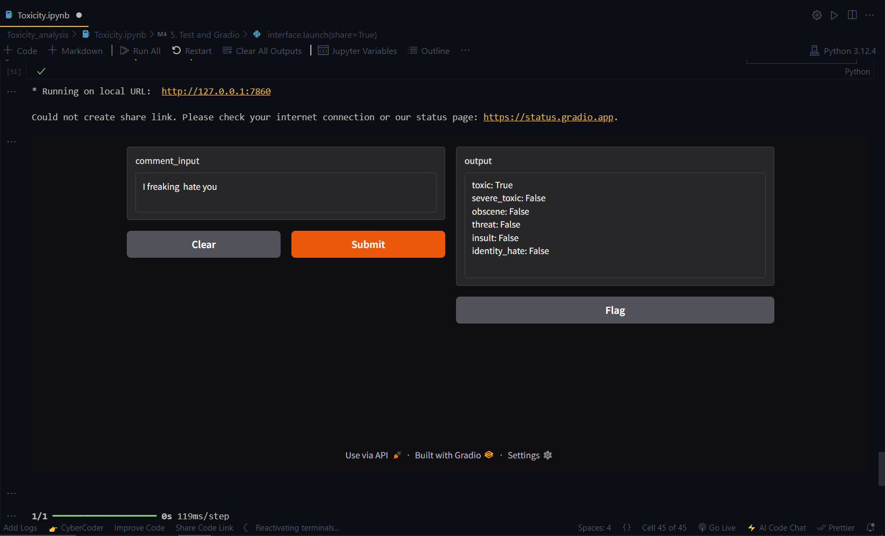

# PosiNeg Analyzer

A TensorFlow deep learning project that classifies user comments for toxicity. This project preprocesses text using advanced tokenization, trains a bidirectional LSTM model for multi-label toxicity prediction, and features an interactive Gradio interface to test and flag comments as positive (non-toxic) or negative (toxic).

---

## Installation

1. **Clone the Repository:**

   ```bash
   git clone https://github.com/yourusername/toxicity-terminator.git
   cd toxicity-terminator

   pip install tensorflow tensorflow-gpu pandas matplotlib scikit-learn gradio jinja2

2. **Output of model :**
  
   

